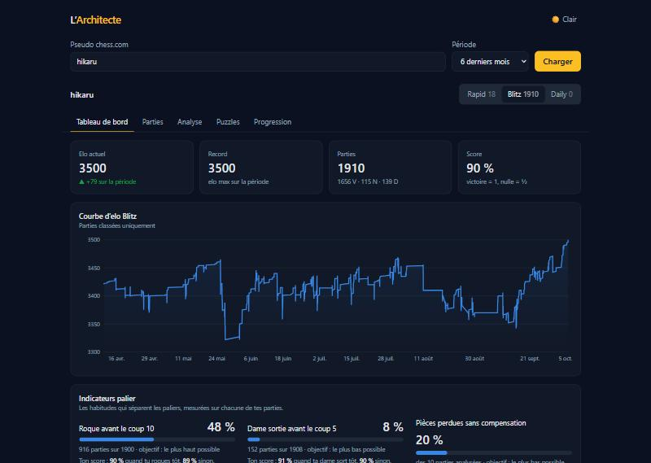
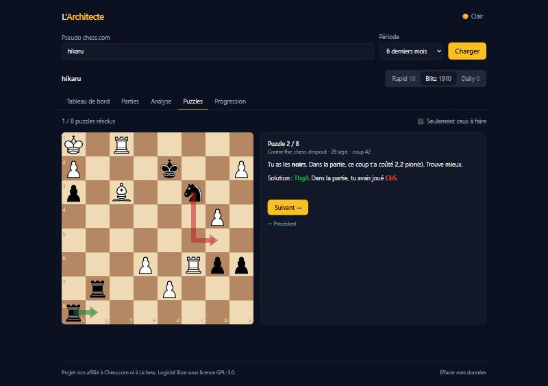

# L’Architecte

> 🇫🇷 Français · [🇬🇧 English](#english)

Tracker de progression aux échecs, gratuit et open source. Tu entres ton pseudo chess.com : l’app
récupère tes parties publiques et te montre **ce qui t’empêche de progresser**. Pensée pour viser 2000+.

Rien à installer, pas de compte, pas de serveur : tout se passe dans ton navigateur.

**Démo :** `https://<ton-pseudo-github>.github.io/l-architecte/` _(voir « Déploiement »)_



## Fonctionnalités

| Onglet              | Ce que tu y trouves                                                                                                                                                      |
| ------------------- | ------------------------------------------------------------------------------------------------------------------------------------------------------------------------ |
| **Tableau de bord** | Courbe d’elo, % de victoires avec les blancs et les noirs, ouvertures (score par famille et par couleur), comment tu perds (mat, abandon, temps), indicateurs « palier » |
| **Parties**         | Toutes tes parties filtrables, badges (roque, dame, gaffes), lien vers la partie, bouton **Analyser sur lichess**                                                        |
| **Analyse**         | Stockfish 19 dans ton navigateur : gaffes, premier gros tournant de chaque partie, pièces perdues sans compensation, phase de jeu où tu gaffes, courbe d’évaluation      |
| **Puzzles**         | Tes propres gaffes à rejouer ; une alternative presque aussi bonne que le coup du moteur est acceptée                                                                    |
| **Progression**     | Mission de la semaine (choisie d’après tes chiffres, suivie automatiquement) et journal de séance                                                                        |



## Utilisation

1. Entre ton pseudo chess.com, choisis une période et clique sur **Charger**.
2. Choisis la cadence (Rapid par défaut, Blitz, Daily).
3. Dans **Analyse**, lance Stockfish sur tes 10 dernières défaites.
4. Rejoue tes gaffes dans **Puzzles**, puis suis ta **mission de la semaine**.

Au retour, ta dernière recherche se relance toute seule et seuls les nouveaux mois sont téléchargés.

## Comment les chiffres sont calculés

- **Roque avant le coup 10** : roque joué à l’un de tes coups 1 à 9. Les parties finies avant ton
  10e coup sans roque sont ignorées (on ne peut pas juger).
- **Dame sortie avant le coup 5** : dame jouée à l’un de tes coups 1 à 4.
- **Score** : victoire = 1, nulle = ½. Pour chaque habitude, l’app compare ton score avec et sans.
- **Gaffe** : coup qui fait perdre plus de 2 pions d’évaluation (évaluations plafonnées à ±10). Le
  meilleur coup du moteur n’est jamais compté comme gaffe.
- **Premier gros tournant** : la première gaffe de la partie, de toi ou de l’adversaire.
- **Pièce perdue sans compensation** : gaffe après laquelle tu as perdu au moins une pièce mineure
  4 demi-coups plus tard, et où l’évaluation confirme qu’il ne s’agissait pas d’un sacrifice.
- **Ouvertures** : regroupées par famille (« Sicilian Defense », « Queens Gambit Declined »…) et par
  couleur, 3 parties minimum ; « à revoir » sous 45 % de score sur au moins 5 parties.

## Données et vie privée

- Seules deux API sont contactées : l’**API publique officielle de chess.com** (lecture seule,
  requêtes une par une, attente automatique si elle répond 429) et l’**import de lichess**
  (uniquement quand tu cliques sur « Analyser sur lichess »).
- Aucun compte, aucun cookie, aucun traceur, aucun serveur à nous. Stockfish tourne sur ton appareil.
- Tes parties, analyses, puzzles et ton journal restent dans ton navigateur (IndexedDB). Le bouton
  **Effacer mes données**, en bas de page, supprime tout.

## Sécurité

- Pseudo validé (`^[a-zA-Z0-9_-]{3,25}$`) et encodé dans les URL ; URL d’archives et identifiants
  lichess vérifiés avant usage.
- Aucun HTML injecté (`dangerouslySetInnerHTML` interdit par ESLint) ; tout texte venant de l’API est
  affiché comme du texte.
- Content-Security-Policy stricte : connexions limitées à `api.chess.com` et `lichess.org`.
- Aucune clé ni secret dans le dépôt ; Dependabot et `npm audit` dans la CI.

## Développement

```bash
npm install
npm run dev      # serveur de développement
npm test         # tests unitaires (Vitest)
npm run lint     # ESLint
npm run build    # build de production dans dist/
```

Architecture : la logique est dans `src/lib/` (fonctions pures, testées), l’état React dans
`src/hooks/`, l’affichage dans `src/components/`.

| Fichier                                              | Rôle                                                   |
| ---------------------------------------------------- | ------------------------------------------------------ |
| `lib/chesscom.ts`                                    | Client de l’API chess.com (séquentiel, gestion du 429) |
| `lib/loader.ts`, `lib/db.ts`                         | Chargement avec cache IndexedDB, mode hors ligne       |
| `lib/games.ts`, `lib/stats.ts`                       | Modèle des parties et statistiques du tableau de bord  |
| `lib/indicators.ts`                                  | Indicateurs palier (rejeu des coups avec chess.js)     |
| `lib/engine.ts`                                      | Pilotage de Stockfish (Web Worker, protocole UCI)      |
| `lib/analysis.ts`                                    | Gaffes, tournant, pièces perdues                       |
| `lib/puzzles.ts`, `lib/mission.ts`, `lib/journal.ts` | Puzzles, mission de la semaine, journal                |

## Déploiement (GitHub Pages)

1. Crée un dépôt GitHub et pousse le projet sur la branche `main`.
2. Dans **Settings → Pages**, choisis **Source : GitHub Actions**.
3. À chaque push sur `main`, la CI vérifie (lint, format, tests, audit, build) puis publie le site.

## Licence

[GPL-3.0](LICENSE) — imposée par Stockfish, lui-même sous GPL-3.0.

**Projet non affilié à Chess.com ni à Lichess.**

## Crédits

- [Stockfish](https://github.com/official-stockfish/Stockfish) (GPL-3.0), version WebAssembly
  [stockfish.js](https://github.com/nmrugg/stockfish.js) de Nathan Rugg (GPL-3.0) — voir `public/engine/`
- Pièces « cburnett » de [Colin M.L. Burnett](https://en.wikipedia.org/wiki/User:Cburnett) (GPLv2+),
  via le dépôt de [lichess](https://github.com/lichess-org/lila)
- [chess.js](https://github.com/jhlywa/chess.js) (BSD-2-Clause)
- [react-chessboard](https://github.com/Clariity/react-chessboard) et [dnd kit](https://dndkit.com) (MIT)
- [Recharts](https://recharts.org) (MIT), [React](https://react.dev) (MIT), [Vite](https://vite.dev) (MIT),
  [Tailwind CSS](https://tailwindcss.com) (MIT)
- Données : [API publique de chess.com](https://www.chess.com/news/view/published-data-api),
  [API d’import de lichess](https://lichess.org/api#tag/Import)
- Icône : dessin original du projet (GPL-3.0)

---

## English

**L’Architecte** is a free, open-source chess progress tracker. Enter your chess.com username: the
app fetches your public games and shows **what keeps you from improving**. Built for players aiming
at 2000+. Nothing to install, no account, no server — everything runs in your browser.

**Demo:** `https://<your-github-username>.github.io/l-architecte/`

### Features

- **Dashboard** — rating curve, win rate with white and black, openings (score per family and
  colour), how you lose (checkmate, resignation, time), “level” habits (castling before move 10,
  queen out before move 5, pieces lost for nothing).
- **Games** — filterable list, habit and blunder badges, one-click **Analyse on lichess** import.
- **Analysis** — Stockfish 19 in your browser: blunders (> 2 pawns), first turning point of each game,
  pieces lost without compensation, game phase where you blunder, evaluation graph.
- **Puzzles** — replay your own blunders; near-best alternatives (within 0.5 pawn) are accepted.
- **Progress** — weekly mission picked from your own numbers and tracked automatically, plus a
  training journal.

### Usage

Enter your username, pick a period, click **Charger** (Load), choose a time control. Then run
Stockfish on your last 10 losses in **Analyse**, replay them in **Puzzles** and follow your weekly
mission in **Progression**.

### Privacy

Only the official read-only chess.com public API (sequential requests, automatic back-off on 429)
and the lichess import API (only when you click the button) are contacted. No account, no cookies,
no tracking, no backend. Data stays in your browser (IndexedDB); **Effacer mes données** (Clear my
data) wipes everything.

### Development

`npm install`, then `npm run dev`, `npm test`, `npm run lint`, `npm run build`. Deployment: push to
`main` and set **Settings → Pages → Source: GitHub Actions**.

### License & credits

[GPL-3.0](LICENSE). **Not affiliated with Chess.com or Lichess.** Stockfish & stockfish.js
(GPL-3.0), cburnett pieces by Colin M.L. Burnett (GPLv2+), chess.js (BSD-2-Clause),
react-chessboard, dnd kit, Recharts, React, Vite, Tailwind CSS (MIT).
